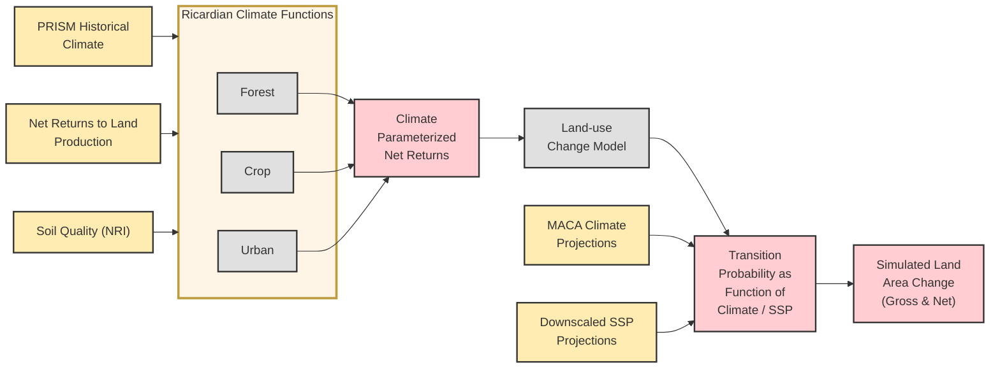
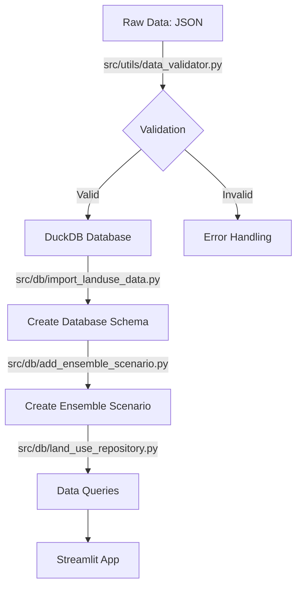
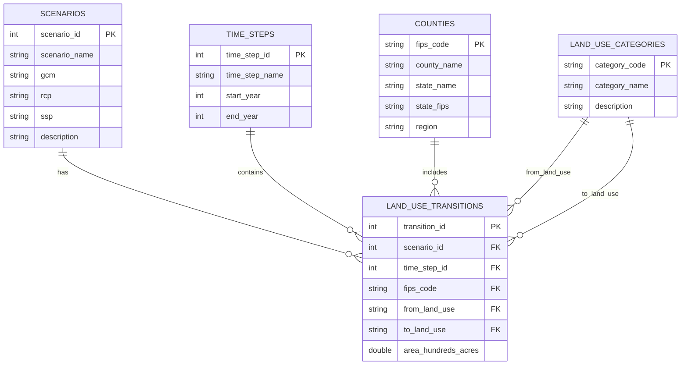
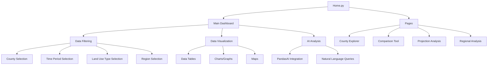

# RPA Land Use Change Data Processing

This repository contains tools for processing and analyzing the USDA Forest Service's Resources Planning Act (RPA) land use change projection data. The dataset provides county-level land use transition projections for the conterminous United States from 2020 to 2070.

## Dataset Overview

The data represents gross land-use changes projected at the county level, based on an empirical econometric model of observed land-use transitions from 2001-2012 using National Resources Inventory (NRI) data. The projections include:

### Land Use Model

The land use projections were generated using a model that integrates climate, economic, and land quality factors:



This diagram shows how the RPA Land Use Model integrates various inputs:
- Historical climate data (PRISM)
- Economic factors (Net Returns to Land Production)
- Land characteristics (Soil Quality from NRI)
- Future climate projections (MACA)
- Future socioeconomic projections (SSPs)

These inputs flow through Ricardian Climate Functions for different land types, producing climate-parameterized net returns that feed into the land-use change model. The model generates transition probabilities as functions of climate and socioeconomic factors, ultimately producing the simulated land area changes found in this dataset.

### Scenarios
The dataset includes 20 unique scenarios that are combinations of climate models and socioeconomic pathways. These scenarios are based on four integrated RPA scenarios that combine climate projections (Representative Concentration Pathways or RCPs) with socioeconomic projections (Shared Socioeconomic Pathways or SSPs):

- **LM**: Lower warming-moderate U.S. growth (RCP4.5-SSP1)
- **HL**: High warming-low U.S. growth (RCP8.5-SSP3)
- **HM**: High warming-moderate U.S. growth (RCP8.5-SSP2)
- **HH**: High warming-high U.S. growth (RCP8.5-SSP5)

Each integrated scenario is run with five different climate models to capture the range of future climate projections:

- Climate Models (GCM):
  - CNRM_CM5 ("wet" climate model)
  - HadGEM2_ES365 ("hot" climate model)
  - IPSL_CM5A_MR ("dry" climate model)
  - MRI_CGCM3 ("least warm" climate model)
  - NorESM1_M ("middle" climate model)

- Emissions and Socioeconomic Pathways:
  - rcp45_ssp1: Low emissions forcing, medium growth
  - rcp85_ssp2: High emissions forcing, medium growth
  - rcp85_ssp3: High emissions forcing, low growth
  - rcp85_ssp5: High emissions forcing, high growth

### Default Scenario View

By default, the application displays an **Average (All Scenarios)** view that presents the ensemble average across all climate-socioeconomic scenarios. This provides a consensus view of land use projections without requiring users to select a specific scenario. Users can still select individual scenarios from the scenario dropdown menu to explore specific climate-socioeconomic pathways.

To create or update the average scenario view:
```bash
# Run the ensemble scenario creation script
./add_ensemble_scenario.sh
```

## Data Status

**IMPORTANT**: This dataset is static and will not be updated. It represents a one-time collection of land use projections from the RPA 2020 Assessment. The database and visualization tools in this repository are designed to work with this fixed dataset, and there is no need for continuous integration or deployment for data updates. Once processed and loaded, the database will contain the complete set of projections through 2070.

### Time Periods
- Calibration period: 2012-2020
- Projection periods: 2020-2070 in 10-year intervals
  - 2020-2030
  - 2030-2040
  - 2040-2050
  - 2050-2060
  - 2060-2070

### Land Use Categories
Transitions between five main land use types:
- Cropland
- Pasture land
- Rangeland
- Forest land
- Urban developed land

### Geographic Coverage
- All counties in the conterminous United States
- Counties identified by 5-digit FIPS codes
- Organized into hierarchical regions (States → Subregions → Regions)

## Data Processing Pipeline

### Data Source

This dataset was developed by Mihiar, Lewis & Coulston for the USDA Forest Service for the Resources Planning Act (RPA) 2020 Assessment. Download the data here: https://doi.org/10.2737/RDS-2023-0026. Unzip the .json data file to data/raw/. 

### Pipeline Overview



1. Raw Data (`data/raw/`)
   - JSON format: `county_landuse_projections_RPA.json`
   - Units: Land area in hundreds of acres
   - See docs/rpa_data/variable_descriptions.md for data dictionary

2. Data Validation
   - Script: `src/utils/data_validator.py`
   - Validates data integrity before database import
   - Checks for required fields, data types, and value ranges

3. DuckDB Database
   - Structured tables for scenarios, time steps, counties, and land use transitions
   - Optimized for querying and analysis
   - Total records: ~5.4 million land use transitions
   - Repository pattern for clean data access

## Installation

1. Create and activate a Python virtual environment:
```bash
# Using UV (recommended)
uv venv
source .venv/bin/activate  # On Linux/Mac
# .venv\Scripts\activate  # On Windows

# OR using conda
conda create -n rpa_landuse python=3.11
conda activate rpa_landuse
```

2. Install the package in development mode:
```bash
# Using UV (recommended)
uv pip install -e .
uv pip install duckdb pandas tqdm python-dotenv

# OR using pip
pip install -e .
```

Required dependencies:
- Pandas: Data processing and analysis
- DuckDB: Database operations (embedded analytics database)
- PyArrow: Parquet file handling
- tqdm: Progress bars for data loading
- python-dotenv: Environment variable management

## Database Setup

The simplest way to set up the database is to use the provided script:

```bash
./setup_database.sh
```

This script will:
1. Create a Python virtual environment using uv
2. Install required dependencies
3. Initialize the DuckDB database schema
4. Import the land use data from the raw JSON file
5. Remove the calibration period (2012) data
6. Remove redundant t1 and t2 columns as these can be calculated from transition data

Alternatively, you can set up the database manually:

1. Create database schema and initialize tables:
```bash
# Initialize the database
python -m src.db.initialize_database --optimize
```

2. Import the data into DuckDB:
```bash
# Import the land use data
python -m src.db.import_landuse_data
```

## Working with Existing Database

If you're joining the project with an existing database setup:

1. Set up the Python environment:
```bash
# Using UV (recommended)
uv venv
source .venv/bin/activate  # On Linux/Mac
# .venv\Scripts\activate  # On Windows

# Install package and dependencies
uv pip install -e .
```

2. Verify database file exists:
```bash
# Check if DuckDB database file exists
ls -l data/database/rpa.db
```

3. Verify data availability (using Python):
```python
import duckdb
conn = duckdb.connect('data/database/rpa.db')
print(conn.execute('SELECT COUNT(*) FROM land_use_transitions').fetchone()[0])
conn.close()
```

Alternatively, if you've installed DuckDB CLI:
```bash
duckdb data/database/rpa.db "SELECT COUNT(*) FROM land_use_transitions"
```

## Querying the Database

The repository includes a command-line tool (`query_db.py`) for quick data exploration and analysis:

```bash
# Make the script executable if needed
chmod +x query_db.py

# List all available tables
./query_db.py tables

# View database schema for a specific table
./query_db.py describe land_use_transitions

# List all scenarios
./query_db.py scenarios

# List all time steps
./query_db.py timesteps

# List all land use types
./query_db.py landuse

# List counties (optionally filter by state)
./query_db.py counties
./query_db.py counties --state "California"

# Query land use transitions with filtering options
./query_db.py transitions --scenario 1 --timestep 2 --limit 10
./query_db.py transitions --scenario 1 --timestep 2 --county "01001" --from cr --to ur

# Run a custom SQL query
./query_db.py query "SELECT * FROM scenarios LIMIT 5"

# Enter interactive SQL mode
./query_db.py interactive
```

The interactive mode provides a SQL prompt where you can run multiple queries in sequence, which is useful for exploratory data analysis.

### Database Schema



The DuckDB database includes the following tables:

1. `scenarios`
   - scenario_id (PK)
   - scenario_name
   - gcm (Global Climate Model)
   - rcp (Representative Concentration Pathway)
   - ssp (Shared Socioeconomic Pathway)
   - description

2. `time_steps`
   - time_step_id (PK)
   - time_step_name
   - start_year
   - end_year

3. `counties`
   - fips_code (PK)
   - county_name
   - state_name
   - state_fips
   - region

4. `land_use_categories`
   - category_code (PK)
   - category_name
   - description

5. `land_use_transitions`
   - transition_id (PK)
   - scenario_id (FK)
   - time_step_id (FK)
   - fips_code (FK)
   - from_land_use (FK)
   - to_land_use (FK)
   - area_hundreds_acres

### Repository Pattern

The application uses a repository pattern to provide a clean API for database access:

1. `base_repository.py` - Base class with common functionality
2. `region_repository.py` - Methods for accessing regional data
3. `land_use_repository.py` - Methods for accessing land use transition data
4. `analysis_repository.py` - Methods for advanced analysis and aggregation

Example query using the repository pattern:
```python
from src.db.land_use_repository import LandUseRepository

# Get all land use transitions for a specific county and scenario
repo = LandUseRepository()
transitions = repo.get_county_transitions(
    county_fips="01001",  # Autauga County, AL
    scenario_id=1,
    time_step_id=2
)
```

## Streamlit Dashboard App

### Application Architecture



A Streamlit-based web application is provided for interactive visualization and analysis of the land use change data. The app features:

1. Data filtering by:
   - County/State/Region
   - Time period (start and end years)
   - Land use types
   - Scenarios

2. Multiple view options:
   - Data tables with land use transition details
   - Statistical summaries of land changes
   - Map visualizations

3. AI-powered analysis:
   - Natural language querying of the data using PandasAI
   - Ask questions about trends, patterns, and statistical information

### Running the Dashboard

1. Set up environment variables:
```bash
# Copy the example environment file
cp .env.example .env

# Edit the .env file to add your OpenAI API key
nano .env  # or use any text editor
```

2. Run the application:
```bash
# Using the provided script (Linux/Mac)
./run_with_py311.sh

# OR manually
streamlit run Home.py
```

3. Open your browser to http://localhost:8501

### Example Queries for PandasAI

Once the app is running, you can ask questions about the data such as:
- "What land use type lost the most acreage?"
- "What's the top destination for converted forest land?"
- "Show me a bar chart of acres by land use type"
- "Calculate the percentage change for each land use type"
- "Which region has the highest forest-to-urban conversion?"

## Geographic Data Hierarchy

The RPA Land Use Viewer includes a hierarchical geographic data structure that organizes spatial data across multiple administrative levels:

### Geographic Levels

1. **Counties**: The base level of geographic data, using 5-digit FIPS codes
2. **States**: Groups counties by state using the first 2 digits of the county FIPS code
3. **Regions**: Broader geographic divisions based on state groupings

### Implementation Details

The database schema implements this hierarchy using:

- **Direct Relationships**: Counties are linked to states via the FIPS code prefix (first 2 digits)
- **Region Field**: Counties have a region field for broader geographic categorization
- **Efficient Querying**: Indexes optimize query performance for different geographic scopes

### Example Usage

```sql
-- Get all counties in a specific region
SELECT fips_code, county_name, region
FROM counties
WHERE region = 'North';

-- Get aggregated land use data at the state level
SELECT 
    SUBSTR(c.fips_code, 1, 2) as state_fips,
    c.state_name,
    lut.from_land_use, 
    lut.to_land_use, 
    SUM(lut.area_hundreds_acres) as total_acres
FROM 
    land_use_transitions lut
JOIN
    counties c ON lut.fips_code = c.fips_code
WHERE 
    lut.scenario_id = 1 
GROUP BY 
    state_fips, c.state_name, lut.from_land_use, lut.to_land_use
ORDER BY
    state_name, total_acres DESC;

-- Compare land use change across regions
SELECT 
    c.region, 
    lut.from_land_use, 
    lut.to_land_use, 
    SUM(lut.area_hundreds_acres) as total_acres
FROM 
    land_use_transitions lut
JOIN
    counties c ON lut.fips_code = c.fips_code
WHERE 
    lut.from_land_use = 'fr'
GROUP BY 
    c.region, lut.from_land_use, lut.to_land_use
ORDER BY
    c.region, total_acres DESC;
```