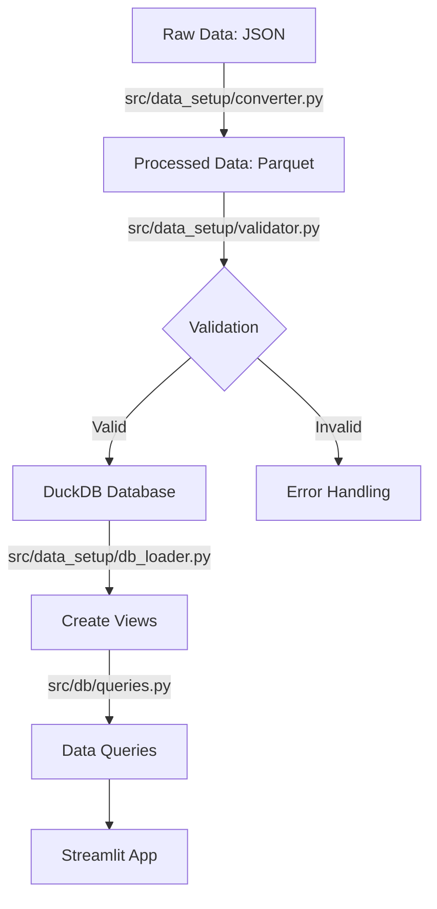
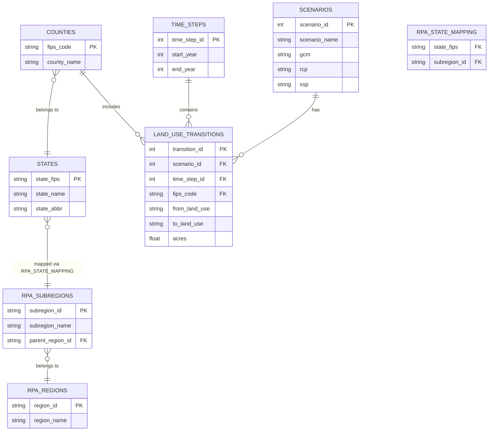
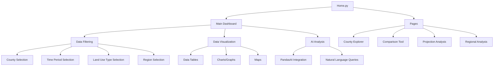

# RPA Land Use Change Data Processing

This repository contains tools for processing and analyzing the USDA Forest Service's Resources Planning Act (RPA) land use change projection data. The dataset provides county-level land use transition projections for the conterminous United States from 2020 to 2070.

## Dataset Overview

The data represents gross land-use changes projected at the county level, based on an empirical econometric model of observed land-use transitions from 2001-2012 using National Resources Inventory (NRI) data. The projections include:

### Scenarios
The dataset includes 20 unique scenarios combining:
- Climate Models (GCM):
  - CNRM_CM5 ("wet" climate model)
  - HadGEM2_ES365 ("hot" climate model)
  - IPSL_CM5A_MR ("dry" climate model)
  - MRI_CGCM3 ("least warm" climate model)
  - NorESM1_M ("middle" climate model)

- Emissions and Socioeconomic Pathways:
  - rcp45_ssp1: Low emissions forcing, medium growth
  - rcp85_ssp2: High emissions forcing, medium growth
  - rcp85_ssp3: High emissions forcing, low growth
  - rcp85_ssp5: High emissions forcing, high growth

## Data Status

**IMPORTANT**: This dataset is static and will not be updated. It represents a one-time collection of land use projections from the RPA 2020 Assessment. The database and visualization tools in this repository are designed to work with this fixed dataset, and there is no need for continuous integration or deployment for data updates. Once processed and loaded, the database will contain the complete set of projections through 2070.

### Time Periods
- Calibration period: 2012-2020
- Projection periods: 2020-2070 in 10-year intervals
  - 2020-2030
  - 2030-2040
  - 2040-2050
  - 2050-2060
  - 2060-2070

### Land Use Categories
Transitions between five main land use types:
- Cropland
- Pasture land
- Rangeland
- Forest land
- Urban developed land

### Geographic Coverage
- All counties in the conterminous United States
- Counties identified by 5-digit FIPS codes
- Organized into hierarchical regions (States → Subregions → Regions)

## Data Processing Pipeline

### Data Source

This dataset was developed by Mihiar, Lewis & Coulston for the USDA Forest Service for the Resources Planning Act (RPA) 2020 Assessment. Download the data here: https://doi.org/10.2737/RDS-2023-0026. Unzip the .json data file to data/raw/. 

### Pipeline Overview



1. Raw Data (`data/raw/`)
   - JSON format: `county_landuse_projections_RPA.json`
   - Units: Land area in hundreds of acres
   - See _variable_descriptions.csv for data dictionary

2. Conversion to Parquet
   - Script: `src/data_setup/converter.py`
   - Converts JSON to columnar Parquet format for efficient processing
   - Output: `data/processed/rpa_landuse_data.parquet`

3. DuckDB Database
   - Structured tables for scenarios, time steps, counties, and land use transitions
   - Optimized for querying and analysis
   - Total records: ~5.4 million land use transitions
   - Regional views for aggregated analysis (counties → states → subregions → regions)

## Installation

1. Create and activate a Python virtual environment:
```bash
# Using UV (recommended)
uv venv .venv-py311 --python 3.11
source .venv-py311/bin/activate  # On Linux/Mac
# .venv-py311\Scripts\activate  # On Windows

# OR using conda
conda create -n rpa_landuse python=3.11
conda activate rpa_landuse
```

2. Install the package in development mode:
```bash
# Using UV (recommended)
uv pip install -r requirements.txt

# OR using pip
pip install -e .
```

Required dependencies:
- Pandas: Data processing and analysis
- DuckDB: Database operations (embedded analytics database)
- PyArrow: Parquet file handling
- NumPy: <2.0.0 for compatibility with pandas 1.5.3
- tqdm: Progress bars for data loading

## Data Loading

1. Convert JSON to Parquet:
```bash
python -m src.data_setup.converter
```

2. Load data into DuckDB and create regional views:
```bash
python -m src.data_setup.db_loader data/processed/rpa_landuse_data.parquet
```

This will:
- Create the DuckDB database file at `data/database/rpa_landuse_duck.db` if it doesn't exist
- Initialize the database schema
- Load the data from the Parquet file into the database
- Create necessary regional analysis views

If you only need to create or refresh the regional views:
```bash
python -m src.data_setup.db_loader --views-only
```

## Working with Existing Database

If you're joining the project with an existing database setup:

1. Set up the Python environment:
```bash
# Using UV (recommended)
uv venv .venv-py311 --python 3.11
source .venv-py311/bin/activate  # On Linux/Mac
# .venv-py311\Scripts\activate  # On Windows

# Install requirements
uv pip install -r requirements.txt
```

2. Verify database file exists:
```bash
# Check if DuckDB database file exists
ls -l data/database/rpa_landuse_duck.db
```

3. Verify data availability (using Python):
```python
import duckdb
conn = duckdb.connect('data/database/rpa_landuse_duck.db')
print(conn.execute('SELECT COUNT(*) FROM land_use_transitions').fetchone()[0])
conn.close()
```

Alternatively, if you've installed DuckDB CLI:
```bash
duckdb data/database/rpa_landuse_duck.db "SELECT COUNT(*) FROM land_use_transitions"
```

### Database Schema



The DuckDB database includes the following tables:

1. `scenarios`
   - scenario_id (PK)
   - scenario_name
   - gcm (Global Climate Model)
   - rcp (Representative Concentration Pathway)
   - ssp (Shared Socioeconomic Pathway)

2. `time_steps`
   - time_step_id (PK)
   - start_year
   - end_year

3. `counties`
   - fips_code (PK)
   - county_name

4. `states`
   - state_fips (PK)
   - state_name
   - state_abbr

5. `rpa_regions`
   - region_id (PK)
   - region_name

6. `rpa_subregions`
   - subregion_id (PK)
   - subregion_name
   - parent_region_id (FK to rpa_regions.region_id)

7. `rpa_state_mapping`
   - state_fips (FK to states.state_fips)
   - subregion_id (FK to rpa_subregions.subregion_id)

8. `land_use_transitions`
   - transition_id (PK)
   - scenario_id (FK)
   - time_step_id (FK)
   - fips_code (FK)
   - from_land_use
   - to_land_use
   - acres

### Database Views

The database includes multiple views to facilitate regional analysis:

1. `county_region_map` - Maps counties to their regions and subregions
2. `state_region_map` - Maps states to their regions and subregions
3. `rpa_region_land_use` - Aggregates land use data at the regional level
4. `rpa_subregion_land_use` - Aggregates land use data at the subregional level
5. `rpa_state_land_use` - Aggregates land use data at the state level

Example regional analysis query:
```sql
-- Get forest-to-urban conversion by region
SELECT 
    rpa_region_name, 
    SUM(acres) as urban_conversion 
FROM 
    rpa_region_land_use 
WHERE 
    from_land_use = 'Forest' AND 
    to_land_use = 'Urban' 
GROUP BY 
    rpa_region_name 
ORDER BY 
    urban_conversion DESC
```

## Streamlit Dashboard App

### Application Architecture



A Streamlit-based web application is provided for interactive visualization and analysis of the land use change data. The app features:

1. Data filtering by:
   - County/State/Region/Subregion
   - Time period (start and end years)
   - Land use types
   - Scenarios

2. Multiple view options:
   - Data tables with land use transition details
   - Statistical summaries of land changes
   - Map visualizations

3. AI-powered analysis:
   - Natural language querying of the data using PandasAI
   - Ask questions about trends, patterns, and statistical information

### Running the Dashboard

1. Set up environment variables:
```bash
# Copy the example environment file
cp .env.example .env

# Edit the .env file to add your OpenAI API key
nano .env  # or use any text editor
```

2. Run the application:
```bash
# Using the provided script (Linux/Mac)
./run_with_py311.sh

# OR manually
streamlit run Home.py
```

3. Open your browser to http://localhost:8501

### Example Queries for PandasAI

Once the app is running, you can ask questions about the data such as:
- "What land use type lost the most acreage?"
- "What's the top destination for converted forest land?"
- "Show me a bar chart of acres by land use type"
- "Calculate the percentage change for each land use type"
- "Which region has the highest forest-to-urban conversion?"

## Geographic Data Hierarchy

The RPA Land Use Viewer includes a hierarchical geographic data structure that organizes spatial data across multiple administrative levels:

### Geographic Levels

1. **Counties**: The base level of geographic data, using 5-digit FIPS codes
2. **States**: Groups counties by state using the first 2 digits of the county FIPS code
3. **Sub-regions**: Groups states into logical geographical regions defined in the RPA
4. **Regions**: Groups sub-regions into major regions (North, South, Rocky Mountain, Pacific Coast)

### Implementation Details

The database schema implements this hierarchy using:

- **Direct Relationships**: Counties are linked to states via the FIPS code prefix (first 2 digits)
- **Mapping Tables**: States are mapped to subregions through the `rpa_state_mapping` table
- **Parent-Child Relationships**: Subregions link to their parent regions through the `parent_region_id` field
- **Views**: Multiple database views provide aggregated data at different geographic levels

### Key Features

- **Flexible Filtering**: The UI allows filtering by national, regional, state, or county levels
- **Aggregation**: Data can be viewed at any level of the hierarchy with appropriate aggregation
- **Relational Integrity**: Foreign key constraints and indexes ensure data consistency across levels
- **Efficient Querying**: Precalculated views optimize query performance for different geographic scopes

### Example Usage

```sql
-- Get all counties in a specific region
SELECT c.fips_code, c.county_name, crm.region_name
FROM counties c
JOIN county_region_map crm ON c.fips_code = crm.fips_code
WHERE crm.region_name = 'North Region';

-- Get aggregated land use data at the regional level
SELECT 
    rpa_region_name, 
    from_land_use, 
    to_land_use, 
    SUM(acres) as total_acres
FROM 
    rpa_region_land_use 
WHERE 
    scenario_id = 1 
GROUP BY 
    rpa_region_name, from_land_use, to_land_use
ORDER BY
    rpa_region_name, total_acres DESC;

-- Compare land use change across subregions within a region
SELECT 
    subregion_name, 
    from_land_use, 
    to_land_use, 
    SUM(acres) as total_acres
FROM 
    rpa_subregion_land_use 
WHERE 
    parent_region_name = 'South Region' AND
    from_land_use = 'Forest'
GROUP BY 
    subregion_name, from_land_use, to_land_use
ORDER BY
    subregion_name, total_acres DESC;
```