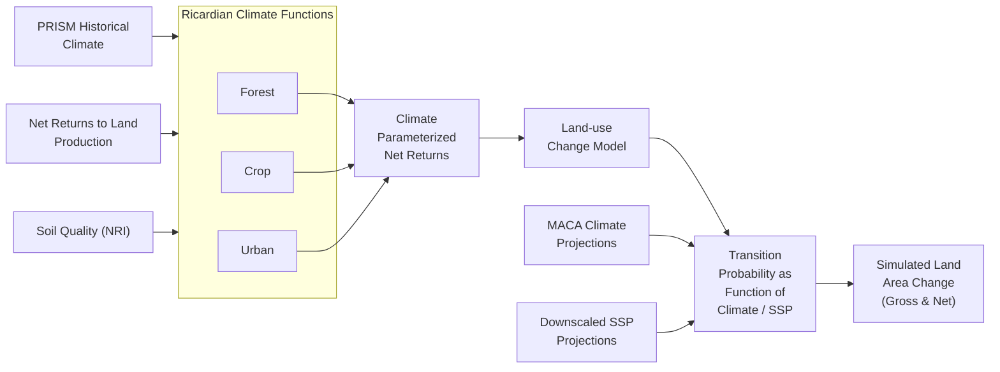
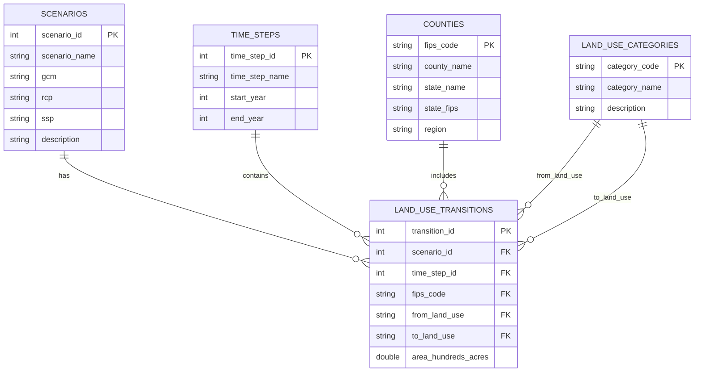

# RPA Land Use Change Data Viewer

## About the RPA Assessment

The Resources Planning Act (RPA) Assessment is a report prepared in response to the mandate in the 1974 Forest and Rangeland Renewable Resources Planning Act (Public Law 93-378, 88 Stat 475, as amended). The 2020 RPA Assessment is the sixth report in this series and provides a comprehensive analysis of the status, trends, and projected future of U.S. forests, forest product markets, rangelands, water, biodiversity, outdoor recreation, and the effects of socioeconomic and climatic change upon these resources.

The Assessment evaluates conditions across all ownerships nationwide and projects resource trends from 2020 to 2070 across four scenarios with differing assumptions about:
- U.S. and global population and economic growth
- Technology change
- Bioenergy preferences
- Openness of international trade
- Wood-energy consumption
- Global climate change

The results inform resource managers and policymakers as they develop strategies to sustain natural resources. Important differences are found regionally and locally, highlighting the need for flexible adaptation and management strategies. The USDA Forest Service uses these results to inform strategic planning and forest planning.

## Key Findings

The RPA Assessment projections reveal several important trends for land use in the United States:

- **Developed land area** is projected to increase in the future, while all non-developed land uses are projected to lose area. The most common source of new developed land is forest land.

- **Forest land area** is projected to decrease under all scenarios, although at lower rates than projected by the 2010 Assessment. Overall forest land losses are projected to be between 1.9 and 3.7 percent by 2070.

- **Climate and economic impacts** vary: Higher projected population and income growth lead to relatively less forest land, while hotter projected future climates lead to relatively more forest land.

- **Sensitivity to factors**: Projected future land use change is more sensitive to the variation in economic factors across RPA scenarios than to the variation among climate projections.

- **Regional variations**: The greatest increases in developed land use are projected for the RPA South Region, with highest forest land loss also projected in this region.

## Dataset Overview

The data represents gross land-use changes projected at the county level, based on an empirical econometric model of observed land-use transitions from 2001-2012 using National Resources Inventory (NRI) data. Land use change is a major driver of resource change, and these projections were made for each county in the conterminous United States from 2020 to 2070.

The projections cover five major land use classes (forest, developed, crop, pasture, and rangeland) and are explicitly linked to projected climate change and socioeconomic change through the 20 RPA scenario-climate futures. All land use change was assumed to occur on privately owned land, with land development treated as an irreversible change. The projections are policy-neutral, based on historical land use relationships driven by future climate change and socioeconomic growth assumptions.

### Land-use Change Model

The land use projections were generated using a model that integrates climate, economic, and land quality factors:



This diagram shows how the RPA Land Use Model integrates various inputs:
- Historical climate data (PRISM)
- Economic factors (Net Returns to Land Production)
- Land characteristics (Soil Quality from NRI)
- Future climate projections (MACA)
- Future socioeconomic projections (SSPs)

These inputs flow through Ricardian Climate Functions for different land use system types, producing climate-parameterized net returns that feed into the land-use change model. The model generates transition probabilities as functions of climate and socioeconomic factors, ultimately producing the simulated land area changes found in this dataset.

### Scenarios
The dataset includes 20 unique scenarios that are combinations of climate model projections and socioeconomic pathways. The RPA Integrated scenarios are based on four combinations of climate projections (Representative Concentration Pathways or RCPs) with socioeconomic projections (Shared Socioeconomic Pathways or SSPs):

- **LM**: Lower warming-moderate U.S. growth (RCP4.5-SSP1)
- **HL**: High warming-low U.S. growth (RCP8.5-SSP3)
- **HM**: High warming-moderate U.S. growth (RCP8.5-SSP2)
- **HH**: High warming-high U.S. growth (RCP8.5-SSP5)

Each integrated scenario is run with five different climate models to capture the range of future climate projections:

- Climate Models (GCM):
  - CNRM_CM5 ("wet" climate model)
  - HadGEM2_ES365 ("hot" climate model)
  - IPSL_CM5A_MR ("dry" climate model)
  - MRI_CGCM3 ("least warm" climate model)
  - NorESM1_M ("middle" climate model)

- Emissions and Socioeconomic Pathways:
  - rcp45_ssp1: Low emissions forcing, medium growth
  - rcp85_ssp2: High emissions forcing, medium growth
  - rcp85_ssp3: High emissions forcing, low growth
  - rcp85_ssp5: High emissions forcing, high growth

### Default Scenario View (Coming Soon)

By default, the application displays an **Average (All Scenarios)** view that presents the ensemble average across all climate-socioeconomic scenarios. This provides a consensus view of land use projections without requiring users to select a specific scenario. Users can still select individual scenarios from the scenario dropdown menu to explore specific climate-socioeconomic pathways.

### Time Periods
- Calibration period: 2012-2020 (Removed from data viewer)
- Projection periods: 2020-2070 in 10-year intervals
  - 2020-2030
  - 2030-2040
  - 2040-2050
  - 2050-2060
  - 2060-2070

### Land Use Categories
Transitions between five main land use types:
- Cropland
- Pasture land
- Rangeland
- Forest land
- Urban developed land

### Geographic Coverage
- All counties in the conterminous United States
- Counties identified by 5-digit FIPS codes
- Organized into hierarchical regions (States → Subregions → Regions)

## Data Source

This dataset was developed by Mihiar, Lewis & Coulston for the USDA Forest Service for the Resources Planning Act (RPA) 2020 Assessment. Download the data here: https://doi.org/10.2737/RDS-2023-0026. Unzip the .json data file to data/raw/. 

## Database Setup

Required dependencies:
- Pandas: Data processing and analysis
- DuckDB: Database operations (embedded analytics database)
- tqdm: Progress bars for data loading
- python-dotenv: Environment variable management

The simplest way to set up the database is to use the provided script:

```bash
./setup_database.sh
```

This script will:
1. Create a Python virtual environment using uv
2. Install required dependencies
3. Initialize the DuckDB database schema
4. Import the land use data from the raw JSON file
5. Remove the calibration period (2012) data
6. Remove redundant t1 and t2 columns as these can be calculated from transition data

## Querying the Database

The repository includes a command-line tool (`query_db.py`) for quick data exploration and analysis:

```bash
# Make the script executable if needed
chmod +x query_db.py

# List all available tables
./query_db.py tables

# View database schema for a specific table
./query_db.py describe land_use_transitions

# List all scenarios
./query_db.py scenarios

# List all time steps
./query_db.py timesteps

# List all land use types
./query_db.py landuse

# List counties (optionally filter by state)
./query_db.py counties
./query_db.py counties --state "California"

# Query land use transitions with filtering options
./query_db.py transitions --scenario 1 --timestep 2 --limit 10
./query_db.py transitions --scenario 1 --timestep 2 --county "01001" --from cr --to ur

# Run a custom SQL query
./query_db.py query "SELECT * FROM scenarios LIMIT 5"

# Enter interactive SQL mode
./query_db.py interactive
```

The interactive mode provides a SQL prompt where you can run multiple queries in sequence, which is useful for exploratory data analysis.

### Database Schema



The DuckDB database includes the following tables:

1. `scenarios`
   - scenario_id (PK)
   - scenario_name
   - gcm (Global Climate Model)
   - rcp (Representative Concentration Pathway)
   - ssp (Shared Socioeconomic Pathway)
   - description

2. `time_steps`
   - time_step_id (PK)
   - time_step_name
   - start_year
   - end_year

3. `counties`
   - fips_code (PK)
   - county_name
   - state_name
   - state_fips
   - region

4. `land_use_categories`
   - category_code (PK)
   - category_name
   - description

5. `land_use_transitions`
   - transition_id (PK)
   - scenario_id (FK)
   - time_step_id (FK)
   - fips_code (FK)
   - from_land_use (FK)
   - to_land_use (FK)
   - area_hundreds_acres

### Repository Pattern (In Development -- needs testing)

The application uses a repository pattern to provide a clean API for database access:

1. `base_repository.py` - Base class with common functionality
2. `region_repository.py` - Methods for accessing regional data
3. `land_use_repository.py` - Methods for accessing land use transition data
4. `analysis_repository.py` - Methods for advanced analysis and aggregation

Example query using the repository pattern:
```python
from src.db.land_use_repository import LandUseRepository

# Get all land use transitions for a specific county and scenario
repo = LandUseRepository()
transitions = repo.get_county_transitions(
    county_fips="01001",  # Autauga County, AL
    scenario_id=1,
    time_step_id=2
)
```

## Geographic Data Hierarchy (Coming Soon)

The RPA Land Use Viewer includes a hierarchical geographic data structure that organizes spatial data across multiple administrative levels:

### Geographic Levels

1. **Counties**: The base level of geographic data, using 5-digit FIPS codes
2. **States**: Groups counties by state using the first 2 digits of the county FIPS code
3. **Regions**: Broader geographic divisions based on state groupings

### Implementation Details

The database schema implements this hierarchy using:

- **Direct Relationships**: Counties are linked to states via the FIPS code prefix (first 2 digits)
- **Region Field**: Counties have a region field for broader geographic categorization
- **Efficient Querying**: Indexes optimize query performance for different geographic scopes