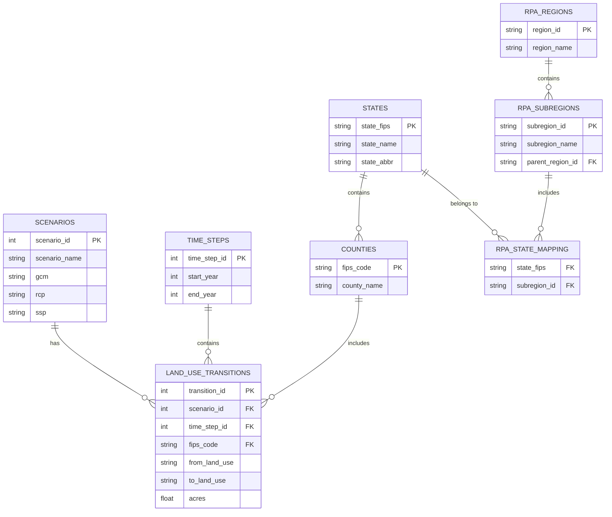
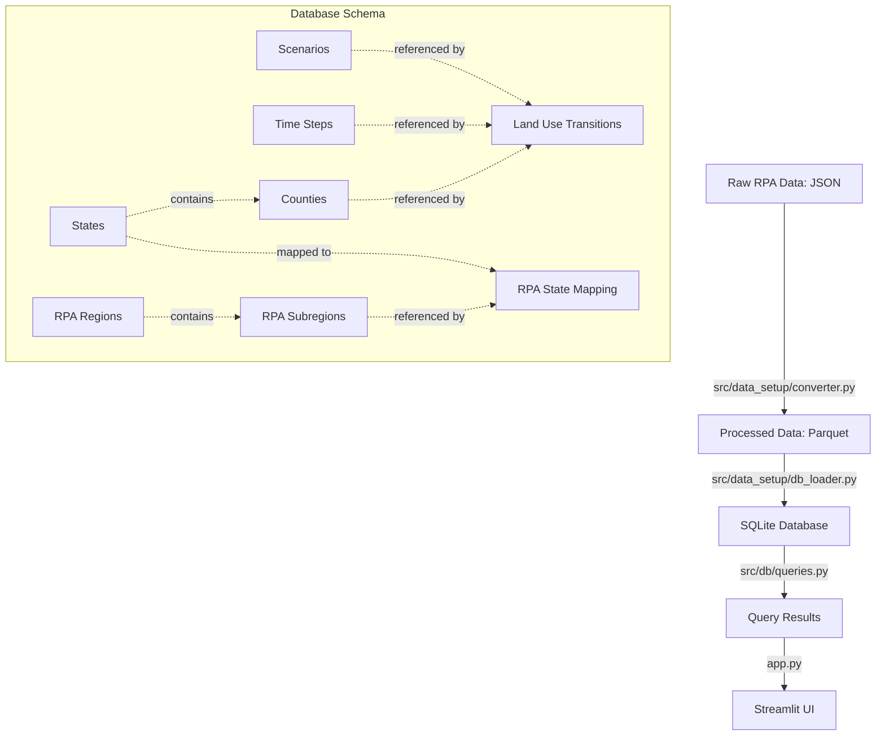

# RPA Land Use Database Schema

This document provides a comprehensive overview of the database schema used in the RPA Land Use Viewer project. The schema is implemented in SQLite, a lightweight, file-based relational database that offers excellent performance for this application.

## Database Overview

- **Database File**: `data/database/rpa_landuse.db`
- **Total Size**: ~319MB
- **Records**: 5,432,198 land use transitions across 3,068 counties with 20 scenarios and 6 time steps

## Entity Relationship Diagram



## Table Descriptions

### 1. `scenarios` (20 records)

Stores information about the climate scenarios used in the land use projections.

| Column | Type | Description |
|--------|------|-------------|
| scenario_id | INTEGER PRIMARY KEY AUTOINCREMENT | Unique identifier for the scenario |
| scenario_name | TEXT UNIQUE NOT NULL | Name of the scenario (e.g., "CNRM_CM5_rcp45_ssp1") |
| gcm | TEXT NOT NULL | Global Climate Model (e.g., "CNRM_CM5", "HadGEM2_ES365") |
| rcp | TEXT NOT NULL | Representative Concentration Pathway (e.g., "rcp45", "rcp85") |
| ssp | TEXT NOT NULL | Shared Socioeconomic Pathway (e.g., "ssp1", "ssp2") |

### 2. `time_steps` (6 records)

Stores information about the time periods for land use projections.

| Column | Type | Description |
|--------|------|-------------|
| time_step_id | INTEGER PRIMARY KEY AUTOINCREMENT | Unique identifier for the time step |
| start_year | INTEGER NOT NULL | Start year of the time period (e.g., 2020) |
| end_year | INTEGER NOT NULL | End year of the time period (e.g., 2030) |

The table includes a UNIQUE constraint on (start_year, end_year) to prevent duplicate time steps.

### 3. `states` (56 records)

Stores information about US states and territories.

| Column | Type | Description |
|--------|------|-------------|
| state_fips | TEXT PRIMARY KEY | The 2-digit FIPS code for the state |
| state_name | TEXT NOT NULL | Full name of the state |
| state_abbr | TEXT NOT NULL | Two letter state abbreviation |

### 4. `counties` (3,068 records)

Stores information about US counties.

| Column | Type | Description |
|--------|------|-------------|
| fips_code | TEXT PRIMARY KEY | The 5-digit FIPS code for the county |
| county_name | TEXT | Name of the county |

The first two digits of the FIPS code represent the state FIPS code, establishing a hierarchical relationship between states and counties.

### 5. `land_use_transitions` (5,432,198 records)

Stores information about land use transitions between different land types.

| Column | Type | Description |
|--------|------|-------------|
| transition_id | INTEGER PRIMARY KEY AUTOINCREMENT | Unique identifier for the transition |
| scenario_id | INTEGER NOT NULL | Foreign key to scenarios.scenario_id |
| time_step_id | INTEGER NOT NULL | Foreign key to time_steps.time_step_id |
| fips_code | TEXT NOT NULL | Foreign key to counties.fips_code |
| from_land_use | TEXT NOT NULL | Original land use type (Crop, Forest, Pasture, Range, Urban) |
| to_land_use | TEXT NOT NULL | New land use type (Crop, Forest, Pasture, Range, Urban) |
| acres | REAL NOT NULL | Land area in hundreds of acres |

### 6. `rpa_regions` (4 records)

Stores information about RPA (Resource Planning Act) Assessment regions.

| Column | Type | Description |
|--------|------|-------------|
| region_id | TEXT PRIMARY KEY | Unique identifier for the RPA region (e.g., "NORTH", "SOUTH") |
| region_name | TEXT NOT NULL | Full name of the region (e.g., "North Region") |

### 7. `rpa_subregions` (13 records)

Stores information about RPA Assessment subregions.

| Column | Type | Description |
|--------|------|-------------|
| subregion_id | TEXT PRIMARY KEY | Unique identifier for the subregion (e.g., "NORTHEAST", "PACNW") |
| subregion_name | TEXT NOT NULL | Full name of the subregion (e.g., "Northeast", "Pacific Northwest") |
| parent_region_id | TEXT NOT NULL | Foreign key to rpa_regions.region_id |

### 8. `rpa_state_mapping` (50 records)

Maps states to RPA subregions to establish the hierarchical relationship.

| Column | Type | Description |
|--------|------|-------------|
| state_fips | TEXT NOT NULL | Foreign key to states.state_fips |
| subregion_id | TEXT NOT NULL | Foreign key to rpa_subregions.subregion_id |

The table includes a composite primary key of (state_fips, subregion_id) to prevent duplicate mappings.

## Views

For efficient querying of hierarchical geographical data, the database includes the following views:

### 1. `county_state_map`

Maps counties to their parent states using the FIPS code relationship.

| Column | Description |
|--------|-------------|
| county_fips | The county FIPS code |
| county_name | Name of the county |
| state_fips | The state FIPS code (first 2 digits of county FIPS) |
| state_name | Name of the state |
| state_abbr | State abbreviation |

### 2. `state_land_use_transitions`

Aggregates land use transitions at the state level.

| Column | Description |
|--------|-------------|
| scenario_id | ID of the scenario |
| scenario_name | Name of the scenario |
| time_step_id | ID of the time step |
| start_year | Start year of the time period |
| end_year | End year of the time period |
| state_fips | State FIPS code |
| state_name | Name of the state |
| state_abbr | State abbreviation |
| from_land_use | Original land use type |
| to_land_use | New land use type |
| acres | Total acres transitioned |

### 3. `region_hierarchy`

Recursive Common Table Expression (CTE) that provides a hierarchical view of geographical entities.

| Column | Description |
|--------|-------------|
| region_id | Identifier for the region (either county FIPS or state FIPS) |
| region_name | Name of the region |
| region_type | Type of region ('COUNTY' or 'STATE') |
| parent_id | ID of the parent region (state FIPS for counties, NULL for states) |
| level | Hierarchy level (0 for counties, 1 for states) |

### 4. `counties_by_state`

Helper view to easily get all counties within a state.

| Column | Description |
|--------|-------------|
| state_fips | State FIPS code |
| state_name | Name of the state |
| state_abbr | State abbreviation |
| county_fips | County FIPS code |
| county_name | Name of the county |

### 5. `state_land_use_summary`

Aggregated metrics for land use by state.

| Column | Description |
|--------|-------------|
| scenario_id | ID of the scenario |
| time_step_id | ID of the time step |
| state_fips | State FIPS code |
| state_name | Name of the state |
| state_abbr | State abbreviation |
| from_land_use | Original land use type |
| to_land_use | New land use type |
| total_acres | Total acres transitioned |
| county_count | Number of counties with this transition |

### 6. `rpa_hierarchy`

Provides a comprehensive hierarchical view of the RPA region structure from counties to regions.

| Column | Description |
|--------|-------------|
| region_id | Identifier for the region entity (could be county FIPS, state FIPS, subregion ID, or region ID) |
| region_name | Name of the region entity |
| region_type | Type of region ('COUNTY', 'STATE', 'SUBREGION', or 'RPA_REGION') |
| parent_id | ID of the parent entity in the hierarchy |
| level | Hierarchy level (0 for counties, 1 for states, 2 for subregions, 3 for regions) |
| subregion_id | Subregion ID that this entity belongs to (NULL for region level) |
| subregion_name | Name of the subregion |
| rpa_region_id | Region ID that this entity belongs to |
| rpa_region_name | Name of the RPA region |

### 7. `rpa_region_land_use`

Aggregates land use transitions at the RPA region level.

| Column | Description |
|--------|-------------|
| scenario_id | ID of the scenario |
| scenario_name | Name of the scenario |
| start_year | Start year of the time period |
| end_year | End year of the time period |
| rpa_region_id | ID of the RPA region |
| rpa_region_name | Name of the RPA region |
| subregion_id | ID of the subregion |
| subregion_name | Name of the subregion |
| from_land_use | Original land use type |
| to_land_use | New land use type |
| acres | Total acres transitioned |

### 8. `rpa_subregion_land_use`

Aggregates land use transitions at the RPA subregion level.

| Column | Description |
|--------|-------------|
| scenario_id | ID of the scenario |
| scenario_name | Name of the scenario |
| start_year | Start year of the time period |
| end_year | End year of the time period |
| subregion_id | ID of the subregion |
| subregion_name | Name of the subregion |
| parent_region_id | ID of the parent RPA region |
| parent_region_name | Name of the parent RPA region |
| from_land_use | Original land use type |
| to_land_use | New land use type |
| acres | Total acres transitioned |

## Indexes

The database uses the following indexes to improve query performance:

```sql
CREATE INDEX idx_land_use_transitions ON land_use_transitions (scenario_id, time_step_id, fips_code);
CREATE INDEX idx_from_land_use ON land_use_transitions (from_land_use);
CREATE INDEX idx_to_land_use ON land_use_transitions (to_land_use);
CREATE INDEX idx_counties_state_fips ON counties(SUBSTR(fips_code, 1, 2));
```

The `idx_counties_state_fips` index enables fast filtering of counties by state FIPS code, which is extracted as the first two characters of the county FIPS code.

## SQLite Best Practices

The schema follows several SQLite best practices:

1. **Use of INTEGER PRIMARY KEY**: Primary keys are defined as INTEGER PRIMARY KEY to leverage SQLite's rowid optimization, which makes these fields aliases for the rowid and improves performance.

2. **Foreign Key Constraints**: All relationships between tables are explicitly defined using foreign key constraints to maintain data integrity.

3. **NOT NULL Constraints**: Key fields are declared as NOT NULL to prevent missing data and ensure data integrity.

4. **Composite Indexes**: Strategic indexes are created on frequently queried combinations of columns to improve query performance.

5. **UNIQUE Constraints**: Applied where appropriate to prevent duplicate data (e.g., time_steps table).

## Recommended Schema Improvements

Based on SQLite best practices from GitHub projects, the following improvements could enhance the current schema:

### 1. Implement STRICT Tables

Converting tables to STRICT mode would enforce type checking and prevent unexpected type coercion:

```sql
CREATE TABLE scenarios (
  scenario_id INTEGER PRIMARY KEY AUTOINCREMENT,
  scenario_name TEXT UNIQUE NOT NULL,
  gcm TEXT NOT NULL,
  rcp TEXT NOT NULL,
  ssp TEXT NOT NULL
) STRICT;
```

### 2. Add Text Column Length Constraints

Add CHECK constraints for TEXT fields to prevent malicious large data insertions:

```sql
CREATE TABLE counties (
  fips_code TEXT PRIMARY KEY CHECK(length(fips_code) = 5),
  county_name TEXT NOT NULL CHECK(length(county_name) < 128)
) STRICT;
```

### 3. Implement Boolean Fields Properly

For any boolean fields that might be added in the future, use the recommended pattern:

```sql
CREATE TABLE example (
  id INTEGER PRIMARY KEY,
  is_active INTEGER NOT NULL CHECK (is_active IN (0, 1))
) STRICT;
```

### 4. Add Schema Version Management

Implement version tracking for schema changes:

```sql
CREATE TABLE schema_info (
  version INTEGER PRIMARY KEY,
  applied_at TEXT DEFAULT (datetime('now')),
  description TEXT NOT NULL
) STRICT;

-- Initialize with current version
INSERT INTO schema_info (version, description) VALUES (1, 'Initial schema');
```

### 5. Additional Indexes for Common Queries

Based on application usage patterns, additional indexes could improve performance:

```sql
-- For queries filtering by land use types
CREATE INDEX idx_from_land_use ON land_use_transitions (from_land_use);
CREATE INDEX idx_to_land_use ON land_use_transitions (to_land_use);

-- For aggregation queries on acres
CREATE INDEX idx_acres ON land_use_transitions (acres);

-- For RPA region queries
CREATE INDEX idx_state_mapping_subregion ON rpa_state_mapping (subregion_id);
CREATE INDEX idx_subregions_parent ON rpa_subregions (parent_region_id);
```

### 6. Add Database Comments

Add comments to document table and column purposes directly in the schema:

```sql
-- Add table comments
PRAGMA table_info = 'Land use transitions represent changes between land types';

-- For SQLite versions that don't support comments directly in schema,
-- consider a documentation table:
CREATE TABLE schema_documentation (
  object_type TEXT NOT NULL,
  object_name TEXT NOT NULL,
  description TEXT NOT NULL,
  PRIMARY KEY (object_type, object_name)
) STRICT;
```

## Data Flow Diagram



## Schema Version Control Strategy

To effectively version control this SQLite schema:

1. **Schema as Code**: Maintain the complete schema definition in the `init.sql` file under version control

2. **Migration Scripts**: For each schema change, create numbered migration scripts:
   ```
   migrations/
   ├── 001_initial_schema.sql
   ├── 002_add_indexes.sql
   ├── 003_add_constraints.sql
   └── 004_add_rpa_regions.sql
   ```

3. **Schema Dump Command**: Use the following command to dump the current schema for version control:
   ```bash
   sqlite3 data/database/rpa_landuse.db ".schema --indent" > docs/current_schema.sql
   ```

4. **Schema Verification**: Add a verification step to ensure the schema matches what's expected:
   ```bash
   sqlite3 :memory: < docs/current_schema.sql
   ```

5. **Schema Documentation**: Automatically update this documentation when schema changes:
   ```bash
   # Count records in each table
   echo "Table record counts:" > docs/schema_stats.md
   echo "-------------------" >> docs/schema_stats.md
   sqlite3 data/database/rpa_landuse.db "SELECT 'scenarios: ' || COUNT(*) FROM scenarios; SELECT 'time_steps: ' || COUNT(*) FROM time_steps; SELECT 'counties: ' || COUNT(*) FROM counties; SELECT 'land_use_transitions: ' || COUNT(*) FROM land_use_transitions; SELECT 'rpa_regions: ' || COUNT(*) FROM rpa_regions; SELECT 'rpa_subregions: ' || COUNT(*) FROM rpa_subregions; SELECT 'rpa_state_mapping: ' || COUNT(*) FROM rpa_state_mapping;" >> docs/schema_stats.md
   ```

## Query Performance Considerations

To optimize query performance, consider the following:

1. **Use Prepared Statements**: For repeatedly executed queries to take advantage of SQLite's query planning.

2. **Limit Result Sets**: When querying large tables like `land_use_transitions`, always include LIMIT clauses to restrict the number of rows returned.

3. **Use EXPLAIN QUERY PLAN**: To understand how SQLite is executing queries and identify potential performance bottlenecks.

4. **Consider Additional Indexes**: If certain query patterns emerge that are not covered by the existing index, consider adding additional indexes on:
   - `from_land_use` and `to_land_use` columns if frequently filtering by these values
   - `acres` column if performing range queries or aggregations on this column
   - `subregion_id` in the `rpa_state_mapping` table if frequently joining on this column

5. **Transaction Management**: Wrap multiple related operations within transactions to improve performance.

## Data Type Considerations

The schema uses the following SQLite data types:

- **INTEGER**: For auto-incrementing primary keys and year values
- **TEXT**: For string data like names, codes, and land use types
- **REAL**: For floating-point values like acres

While SQLite's strict typing is not enabled, the schema does enforce type consistency through application logic and foreign key constraints.

## Maintenance Recommendations

1. **Regular Database Vacuuming**: Run VACUUM periodically to reclaim space and potentially improve performance.

2. **Database Backups**: Implement regular database backups to prevent data loss.

3. **Schema Version Tracking**: Consider implementing a version tracking table to manage schema migrations:

```sql
CREATE TABLE schema_version (
    version INTEGER PRIMARY KEY,
    applied_at TIMESTAMP DEFAULT CURRENT_TIMESTAMP,
    description TEXT
);
```

4. **Query Monitoring**: Consider logging slow-running queries to identify optimization opportunities.

## Usage Examples

Here are some example queries to work with the database:

### Get all land use transitions for a specific county

```sql
SELECT lt.transition_id, s.scenario_name, ts.start_year, ts.end_year, 
       lt.from_land_use, lt.to_land_use, lt.acres
FROM land_use_transitions lt
JOIN scenarios s ON lt.scenario_id = s.scenario_id
JOIN time_steps ts ON lt.time_step_id = ts.time_step_id
WHERE lt.fips_code = '36001' -- Albany County, NY
ORDER BY ts.start_year, lt.from_land_use, lt.to_land_use;
```

### Get net change in forest land by time period

```sql
SELECT ts.start_year, ts.end_year,
       SUM(CASE WHEN lt.to_land_use = 'Forest' THEN lt.acres ELSE 0 END) -
       SUM(CASE WHEN lt.from_land_use = 'Forest' THEN lt.acres ELSE 0 END) AS net_forest_change
FROM land_use_transitions lt
JOIN time_steps ts ON lt.time_step_id = ts.time_step_id
WHERE lt.scenario_id = 1
GROUP BY ts.start_year, ts.end_year
ORDER BY ts.start_year;
```

### Get land use transitions aggregated by RPA region

```sql
SELECT r.region_name, lt.from_land_use, lt.to_land_use, SUM(lt.acres) as total_acres
FROM land_use_transitions lt
JOIN counties c ON lt.fips_code = c.fips_code
JOIN states s ON SUBSTR(c.fips_code, 1, 2) = s.state_fips
JOIN rpa_state_mapping rsm ON s.state_fips = rsm.state_fips
JOIN rpa_subregions sr ON rsm.subregion_id = sr.subregion_id
JOIN rpa_regions r ON sr.parent_region_id = r.region_id
WHERE lt.scenario_id = 1
GROUP BY r.region_name, lt.from_land_use, lt.to_land_use
ORDER BY r.region_name, lt.from_land_use, lt.to_land_use;
``` 