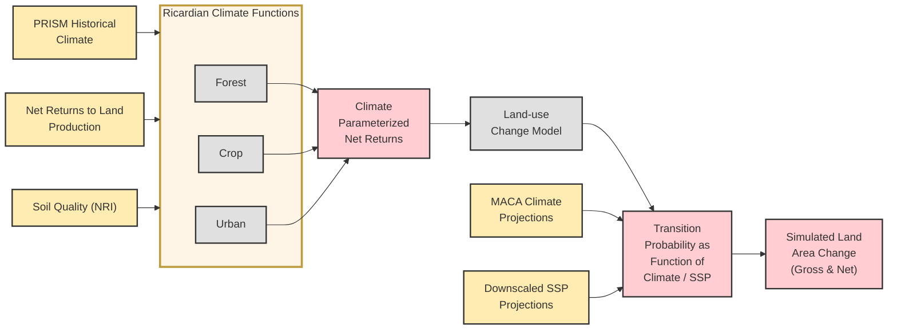

# RPA Land Use Model Diagram

This diagram represents the RPA Land Use Model's data flow and components, showing how various inputs like climate data and soil quality flow through the Ricardian Climate Functions and ultimately produce simulated land area changes. 